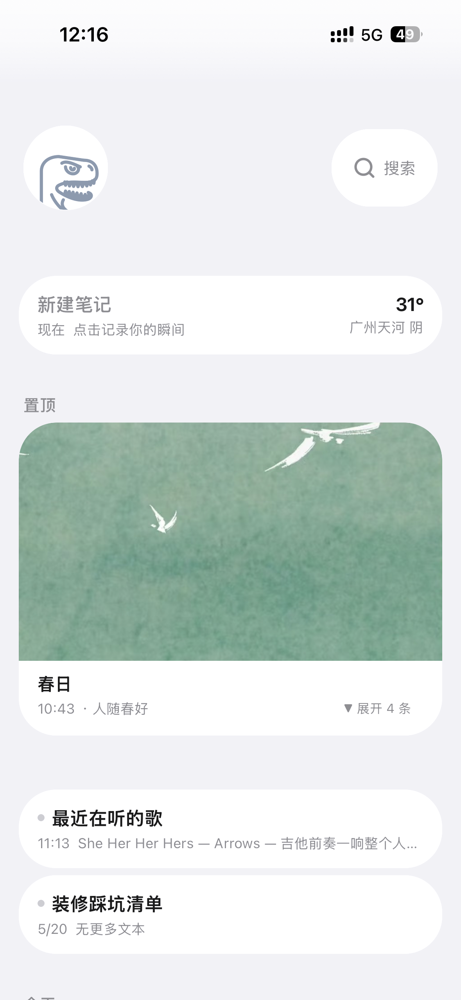
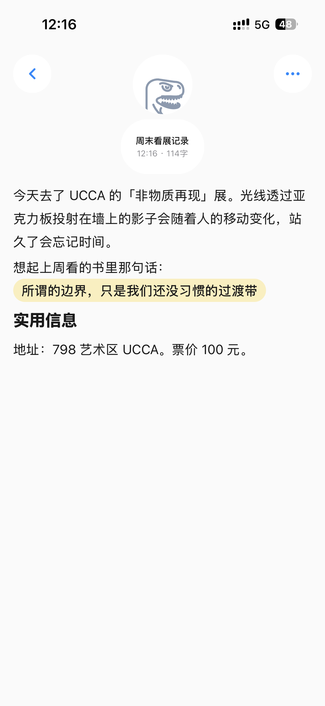
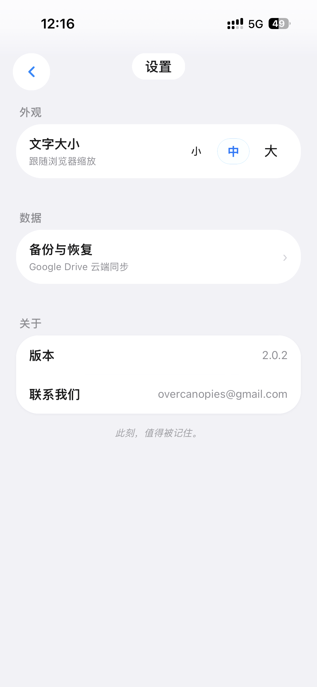
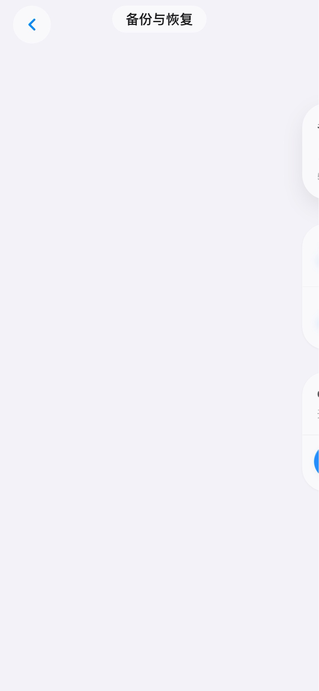
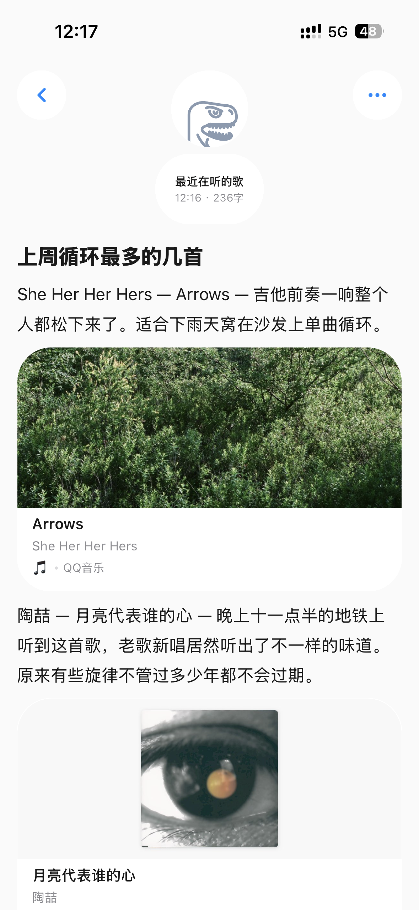

# 

  

  <strong>此刻</strong>

#

  
  
  

有时候你只是想记一句话、存一张图、贴一个链接。  
不想先建目录，不想被一堆按钮打断，也不想为了记点东西先登录账号。  
「此刻」就是为这种场景做的：无需选择模版，打开就写，数据归你。

音乐链接贴进去自动变卡片、标题点一下就能改、顶部渐变随背景色自适应——这些细节你可能用着用着才会发现。

---

## 这个 App 想解决什么问题

不是做一个"最强笔记系统"，而是做一个你愿意每天顺手打开的记录工具。

你会在这些时刻用到它：

- 🚇 地铁上突然想到一个点子，想马上记下
- 🎵 刷到一首歌，想留个卡片以后再听
- 📋 记会议要点、待办、灵感碎片，不想切来切去
- ✨ 对日常碎片化记录，想做个好看的排版

---

## 日常会用到的功能

### 📝 记
- 段落、标题、待办、引用、分割线、代码块、Callout 提示块
- 图文卡片、图片卡片、文件附件（图片自动渲染，PDF/Word 等文件支持点击系统分享）、音乐卡片（粘贴链接 / 斜杠命令插入，通过 Cloudflare Worker 抓取元数据，部分地区可能受限）
- 标题胶囊：滚动自适应横竖排，点一下就能改
- 斜杠命令面板：29 种排版命令，支持搜索筛选和最近使用
- Markdown 自动渲染（**粗体**、*斜体*、~~删除线~~、`行内代码`；应用内额外支持 ==高亮==、#标签蓝色胶囊）

### 👀 看
- 首页按时间分组，信息一眼就能找到
- 支持置顶、展开/收起长分组
- 图文卡片自动识别文件类型，图片显示原图，非图片文件可点击打开
- 从编辑页返回时，首页从右侧跟随滑入，过渡自然

### 💾 存
- 默认本地保存（IndexedDB + localStorage 双通道）
- Google Drive 云备份 / 云端恢复（合并云端与本地数据）
- ZIP 导出/导入（含所有图片和附件）
- 不登录账号也能用全部功能
- 登录后数据仅存你自己的 Google Drive，不过服务端

### 🎨 调
- 字号切换
- 笔记背景色（8 色可选，顶部渐变自适应背景色）
- 头像（含 Google 头像自动同步）
- 毛玻璃样式全 App 统一

---

## 和常见笔记工具不一样的地方

| | 其他笔记 | 此刻 |
|---|---|---|
| **组织体系** | 文件夹 / 标签树 / 数据库 | 打开就写，时间流 |
| **账号** | 强制注册登录 | 不登录也能用全部功能 |
| **数据** | 默认存服务端 | 默认存本地，可选择云备份 |
| **外观** | 功能优先 | iOS 原生感（毛玻璃、过渡、圆角） |

---

## 界面预览

点击展开截图

### 首页

### 编辑页

### 设置页

### 备份页

### 音乐卡片

---

## 隐私

- 没有第三方追踪和统计
- 不登录也能用全部功能
- 数据默认只在你设备本地（IndexedDB）
- 只有你主动点备份到 Google Drive 时，数据才会离开你的设备
- 云备份存的是你自己的 Google Drive，不经手任何第三方服务器

---

## 技术说明

- React 18（UMD）
- IndexedDB + localStorage
- Cloudflare Worker（链接抓取）
- 运行时异常捕获模块（ErrorBoundary + 浮动调试面板）
- 依赖本地化，无运行时 CDN

