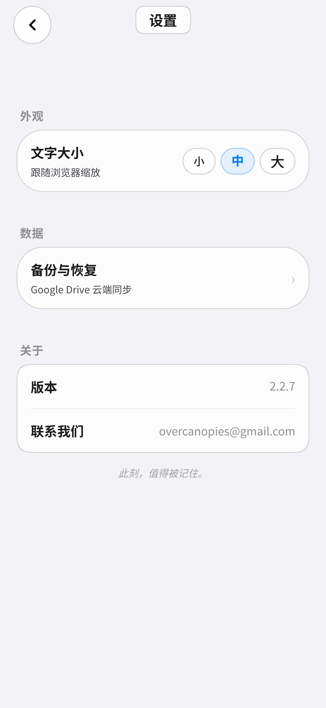

# 

  

  <strong>此刻</strong>

  
  
  

有时候你只是想记一句话、存一张图、贴一个链接。  
不想先建目录，不想被一堆按钮打断，也不想为了记点东西先登录账号。  
「此刻」就是为这种场景做的：无需选择模版，打开就写，数据归你。

音乐链接贴进去自动变卡片、标题点一下就能改、顶部渐变随背景色自适应——这些细节你可能用着用着才会发现。

---

## 这个 App 想解决什么问题

不是做一个"最强笔记系统"，而是做一个你愿意每天顺手打开的记录工具。

你会在这些时刻用到它：

- 🚇 地铁上突然想到一个点子，想马上记下
- 🎵 刷到一首歌，想留个卡片以后再听
- 📋 记会议要点、待办、灵感碎片，不想切来切去
- ✨ 对日常碎片化记录，想做个好看的排版

---

## 日常会用到的功能

### 📝 记
- 段落、标题、待办、引用、分割线、代码块、Callout 提示块
- 图文卡片、图片卡片、文件附件（图片自动渲染，PDF/Word 等文件支持点击系统分享）、音乐卡片（粘贴链接 / 斜杠命令插入，通过 Cloudflare Worker 抓取元数据，部分地区可能受限）
- 标题胶囊：滚动自适应横竖排，点一下就能改
- 斜杠命令面板：29 种排版命令，支持搜索筛选和最近使用
- Markdown 自动渲染（**粗体**、*斜体*、~~删除线~~、`行内代码`；应用内额外支持 ==高亮==、#标签蓝色胶囊）

### 👀 看
- 首页按时间分组，信息一眼就能找到
- 支持置顶、展开/收起长分组
- 图文卡片自动识别文件类型，图片显示原图，非图片文件可点击打开
- 从编辑页返回时，首页从右侧跟随滑入，过渡自然

### 💾 存
- 默认本地保存（IndexedDB + localStorage 双通道）
- Google Drive 云备份 / 云端恢复（合并云端与本地数据）
- ZIP 导出/导入（含所有图片和附件）
- 不登录账号也能用全部功能
- 登录后数据仅存你自己的 Google Drive，不过服务端

### 🎨 调
- 字号切换
- 笔记背景色（8 色可选，顶部渐变自适应背景色）
- 头像（含 Google 头像自动同步）
- 毛玻璃样式全 App 统一

---

## 和常见笔记工具不一样的地方

| | 其他笔记 | 此刻 |
|---|---|---|
| **组织体系** | 文件夹 / 标签树 / 数据库 | 打开就写，时间流 |
| **账号** | 强制注册登录 | 不登录也能用全部功能 |
| **数据** | 默认存服务端 | 默认存本地，可选择云备份 |
| **外观** | 功能优先 | iOS 原生感（毛玻璃、过渡、圆角） |

---

## 界面预览

点击展开截图

### 首页

### 编辑页

### 设置页

### 备份页

### 音乐卡片

---

## 隐私

- 默认笔记和附件保存在本机 IndexedDB；导出的 ZIP 与 Drive 备份目前没有客户端加密。
- 天气功能会自动请求浏览器定位；定位不可用时会尝试 IP 定位，并把坐标发送给和风天气查询天气与城市。客户端包含和风天气 API key（属于公开凭据，应在服务商侧限制来源与额度）。
- 链接元数据和图片代理请求会把目标 URL 发送到 `mynote.overtrees.workers.dev`；Worker 实现不在本仓库中，无法从此仓库确认其日志、转发或保留策略。
- 只有你主动连接 Google Drive 并备份时，笔记/附件才上传到你自己的 Drive appData；Google OAuth token 仅保存在当前页面内存中，不写入本地存储。
- Google 头像 URL 可能保存在本机；浏览器本身也会向天气、Google、和风天气和 Worker 等服务发送必要请求。

---

## 技术说明

- React 18（UMD）
- IndexedDB + localStorage
- Cloudflare Worker（链接抓取）
- 运行时异常捕获模块（ErrorBoundary + 浮动调试面板）
- 依赖本地化，无运行时 CDN

### 代码结构

- `Moment.html`：只保留页面骨架、样式与脚本引用
- `src/app/`：运行时桥接、Editor、列表、天气、启动等应用模块
- `src/styles/`：全局设计令牌、基础样式、编辑器/卡片/面板样式
- `src/editor/`、`src/components/`、`src/services/`：可复用编辑器、组件与存储能力
- `tools/verify.mjs`：校验本地资源、版本串、跨模块声明与 CSS 变量完整性

### 自动视觉回归

`npm run check` 会运行静态校验、单元测试和 Chromium 截图回归。视觉矩阵覆盖手机、平板、桌面三种视口，浅色/深色主题，以及默认透明度、减少透明度偏好和无 `backdrop-filter` 回退（共 18 组）。运行前需有 Chromium 可执行文件（默认路径为 `/usr/bin/chromium`）。

单独运行可使用 `npm run test:browser:visual`。只有在有意调整界面并审阅结果后，才使用 `UPDATE_VISUAL_BASELINES=1 npm run test:browser:visual` 更新 `tests/browser/visual-baselines/` 中的基线；默认运行会与基线做像素比较。需要时可通过 `CHROME=/path/to/chromium` 指定浏览器。
